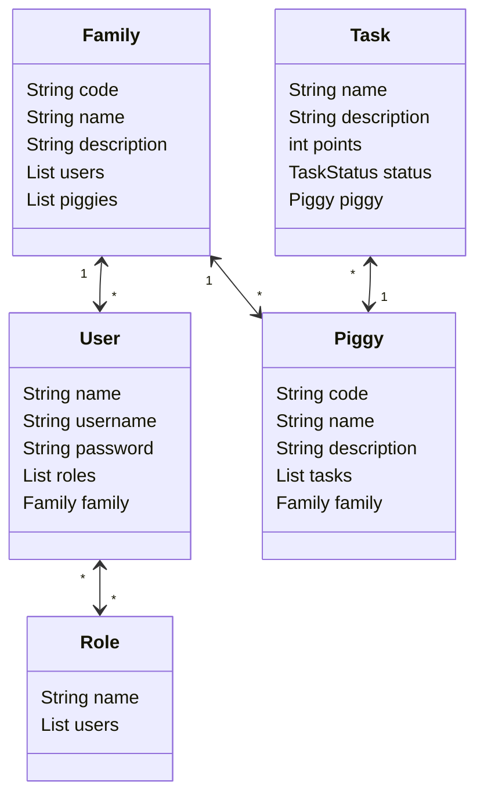

# PiggyWise (Frontend)

Este é o repositório do frontend do projeto PiggyWise, MVP desenvolvido para a
disciplina de Desenvolvimento de Produtos da UERJ em 2024.2.

### Contexto do Produto

PiggyWise é um cofrinho inteligente associado a um app de gamificação de tarefas domésticas entre pais e filhos, que visa educar financeiramente assim como ensinar sobre a responsabilidade doméstica.
Cada tarefa concluída associada a um cofrinho acumula pontos que podem ser trocados por recompensas criadas pelos responsáveis.
É possível criar e se juntar a uma família assim como vincular o seu PiggyWise físico a sua conta.
Os responsáveis fazem o gerenciamento das tarefas e associam cada atividade a um ou mais membros da família.
É possível definir prazos para cada tarefa.
O valor de cada tarefa deve ser depositado de forma manual através das moedas fictícias (RFID) que acompanham o produto, para que assim sejam computadas no app.

